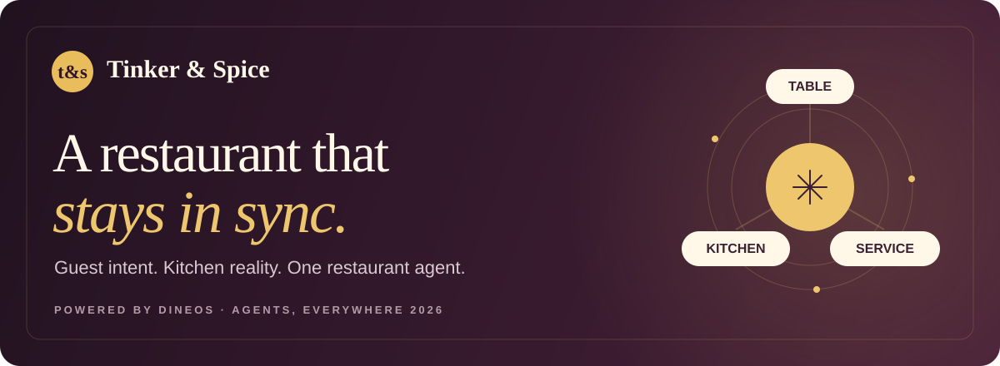
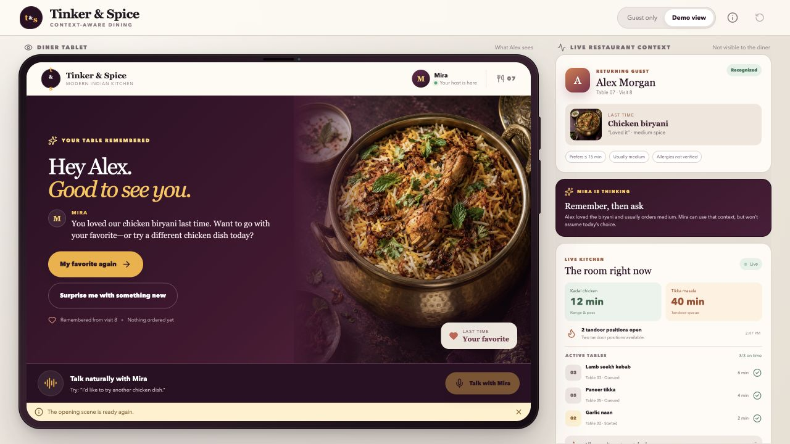
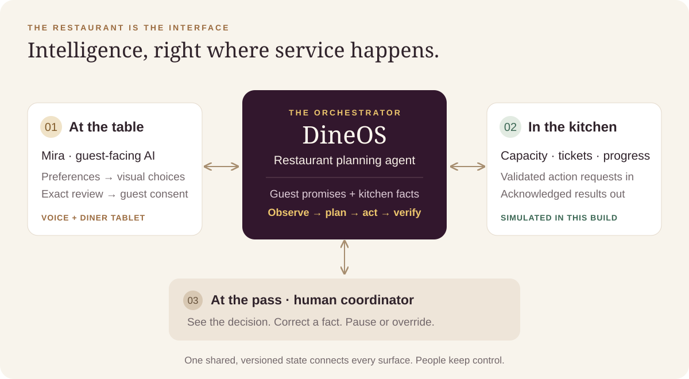
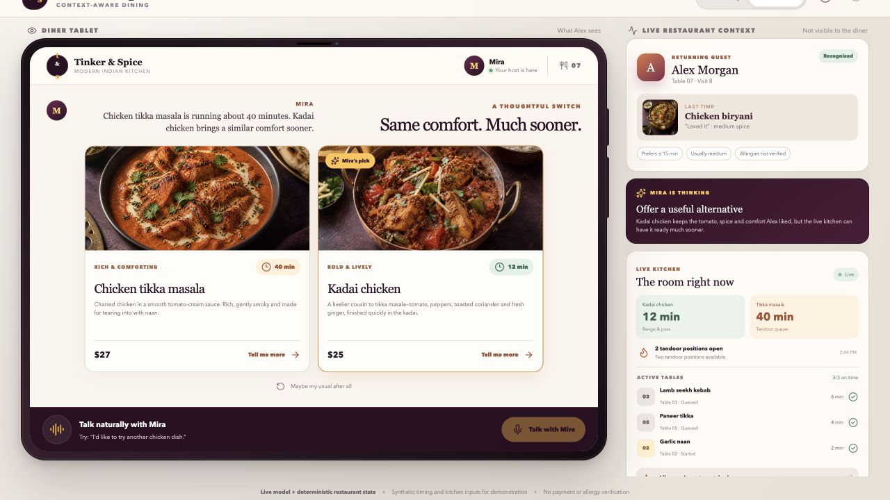
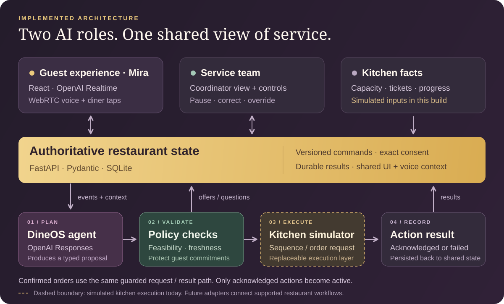

<div align="center">



<br>

**An AI restaurant agent that connects what guests want with what the kitchen can deliver.**

[The idea](#the-restaurant-is-the-interface) · [The experience](#one-guest-one-choice-the-whole-room-in-context) · [The engineering](#how-it-works) · [What's real](#built-today-designed-to-go-further) · [Run it](docs/RUNBOOK.md)

</div>

<br>



<p align="center"><sub>The working prototype. Guest tablet on the left; restaurant context for the demo audience on the right.<br>Guest profiles, kitchen inputs, and timing are simulated. Screens captured through the tap flow.</sub></p>

## The restaurant is the interface

A guest has a favorite dish. The kitchen has a queue. The coordinator has promises to keep. During service, those facts change constantly—and someone has to connect them.

**DineOS gives that coordination a home.** Its restaurant agent watches capacity, active tickets, and accepted ready-by commitments, then proposes preparation decisions under human supervision. At the table, **Mira** turns that same context into a warm conversation and a screen that changes with the guest's intent.

**Tinker & Spice** is the restaurant experience built around it: a working slice of a service where the table, kitchen, and coordinator stay in sync.



The intelligence sits inside the flow of work: choosing a meal, reviewing an order, reporting a capacity change, and coordinating preparation. A kitchen update can change the plan and what the guest hears. A guest's confirmation becomes a commitment the restaurant agent must protect.

<table>
<tr>
<td width="33%" valign="top">

### For the guest

A familiar welcome, visual choices, and useful timing tradeoffs before committing to an order.

</td>
<td width="33%" valign="top">

### For the kitchen

Preparation decisions grounded in capacity and existing tickets, with an explicit request-and-acknowledgment loop.

</td>
<td width="33%" valign="top">

### For the coordinator

A shared operational view, a concise decision rationale, and controls to correct facts, pause, or override.

</td>
</tr>
</table>

## One guest. One choice. The whole room in context.

Alex returns for lunch. Mira remembers the chicken biryani from the last visit, but asks what sounds good **today**.

1. **Remember.** A seeded guest profile gives Mira a starting point: a previous favorite, usual spice level, and a preference for food ready within 15 minutes.
2. **Discover.** “Something different” becomes three visual chicken dishes. Voice and touch lead through the same structured interface.
3. **Notice.** Tikka masala is about **40 minutes** in this scenario. Kadai chicken is about **12 minutes**. Mira can connect the guest's taste to the kitchen's current constraints.
4. **Follow through.** Alex chooses a dish and spice level, reviews the exact terms, and confirms. The order moves through a requested action to a kitchen acknowledgment.



<p align="center"><sub>One operational fact, expressed as a useful guest choice. These are synthetic food-ready estimates, not measured wait-time improvements.</sub></p>

### Behind the welcome, an agent runs the service loop

When a cook reports reduced tandoor capacity, DineOS receives a **new fact**. The server wakes the planning agent, which evaluates the active tickets against feasible sequences and existing commitments. It can propose a sequence, offer a diner alternative, or request a targeted coordinator update.

A deterministic validator checks the proposal. A valid kitchen action becomes **requested**; it becomes **active only after acknowledgment**. Accepted results flow back into the restaurant state, the diner UI, and Mira's voice context.

Keeping an already-safe sequence is a valid decision. When no plan can honor the constraints, the system surfaces the exception for the coordinator.

> **The moment to watch:** use **Simulate a rush** and watch the kitchen's decision rationale and acknowledgment. Expand **Operator tools** for the coordinator's controls. The [rehearsal guide](docs/RUNBOOK.md#show-the-restaurant-agent-too) covers this alongside Alex's diner flow.

## How it works

Two AI roles share one authoritative restaurant state. **Mira handles the guest interaction. DineOS handles restaurant planning.** Deterministic code governs what either may change.



| Layer | Implementation | Responsibility |
| --- | --- | --- |
| Guest experience | React, TypeScript, curated UI surfaces | Welcome, discovery, comparison, exact review, order status |
| Voice interaction | OpenAI Realtime over WebRTC | Natural speech and validated `dineos_intent` tool calls |
| Restaurant agent | OpenAI Responses API; `gpt-5-mini` by default | Event-driven planning and typed sequence, alternative, or clarification proposals |
| State & policy | FastAPI, Pydantic, SQLite | Versioned commands, consent, feasibility, atomic allocation, durable results |
| Kitchen execution | Local simulator | Capacity reports, ticket progress, and automatic/manual/failed acknowledgments |

### Built to handle the awkward moments

- **A recommendation is not an order.** Browsing and review reserve nothing. Confirmation requires the exact offer, revision, and terms; changed terms require a fresh review.
- **A retry is not a second order.** Commands have unique IDs and stored results. Exact replays return the original result; altered payloads conflict.
- **A new plan must respect existing promises.** Started work and accepted ready-by commitments are protected. Confirmed meals are never silently substituted.
- **A requested action is not a completed action.** Failed acknowledgments remain visible. Failed orders release their allocation; a new choice needs fresh consent.
- **The coordinator stays in control.** Pause, guarded override, and source-tagged corrections operate at the server boundary. Interrupted or stale voice actions are rejected.

<details>
<summary><strong>Explore the implementation and verification</strong></summary>

<br>

| Read the code | What to look for |
| --- | --- |
| [Restaurant planner](backend/app/planner.py) | Authorized state, feasible candidates, real model call, one typed proposal |
| [Execution loop](backend/app/engine.py) | Event-driven planning, acknowledgments, conflict recovery |
| [State repository](backend/app/repository.py) · [Domain rules](backend/app/domain.py) | Persistence, exact confirmation, allocation, commitments, stale-state rejection |
| [Realtime client](src/realtime.ts) · [App coordination](src/App.tsx) | Speech generations, interruptions, accepted state → voice/UI context |
| [Backend tests](backend/tests/test_restaurant.py) · [Client tests](src/test) | Contention, replay, failures, recovery, and the full planning loop |

Automated tests use deterministic fixtures and injected planner doubles. They exercise the software boundaries; live voice needs a separate microphone rehearsal. A bounded live planner probe is included in the [verification guide](docs/RUNBOOK.md#verify).

Operational state version, presentation revision, and speech response generation are tracked separately. The observer rail's “Mira is thinking” cards are curated explanations of the UI state; the planning agent's recorded rationale appears in the kitchen status. Full structured decisions and actions are available from the local `/api/state` endpoint.

</details>

## Built today. Designed to go further.

The prototype's **model calls, tool execution, state transitions, validation, persistence, and acknowledgment handling are implemented**. The restaurant data and physical execution are simulated.

| Working in this build | Simulated for the demonstration |
| --- | --- |
| Live Realtime voice and a separate Responses planner, with your API key | Alex's profile, visit history, preferences, menu, prices, and stock |
| Shared state across the guest, kitchen, and coordinator surfaces | Existing tickets, cook reports, kitchen capacity, and preparation progress |
| Exact order consent, atomic allocation, and durable command replay | A paused scenario clock and synthetic food-ready estimates |
| Validated requests, acknowledgment handling, and visible failure recovery | A local kitchen simulator providing acknowledgments instead of physical kitchen systems |

The replaceable boundary is the **kitchen input and execution layer**. A future adapter could translate real staff reports and point-of-sale / kitchen-display events into the existing command contracts, then map action requests and acknowledgments to the connected system. Vendor permissions, event semantics, freshness, and real preparation timings would still need integration work and validation.

| Expansion path | What it could enable | What remains to build |
| --- | --- | --- |
| **Connect a restaurant** | Use live tickets, availability, staff updates, and preparation milestones | POS/KDS adapters, authenticated staff workflows, calibrated timing |
| **Coordinate more of service** | Support multiple diners, courses, stations, and handoffs | Per-table permissions, richer scheduling, broader operational testing |
| **Learn with permission** | Carry useful preferences between visits | Opt-in identity and memory, correction, retention, and deletion controls |
| **Measure the outcome** | Evaluate commitment reliability and coordinator workload | A restaurant pilot measuring missed promises, interventions, and recovery effort |

These are expansion opportunities, not current integrations or measured outcomes. The current scope is one recognized diner, several seeded kitchen tickets, and a supervised restaurant planning loop. Payments, allergy verification, production identity, and physical hardware deployment are outside this build.

## What this entry demonstrates

Built for **[Agents, Everywhere](https://nyc.aitinkerers.org/hackathons/h_2KGgllpHf_k)**, with evidence mapped to the event's judging criteria:

| Criterion | Evidence in the build |
| --- | --- |
| Core requirements & functionality | A complete path from guest intent to exact confirmation and kitchen acknowledgment |
| Innovation & theme alignment | The restaurant environment supplies the context, constraints, and actions that make the agent useful |
| Technical execution & integration | Two model roles, shared durable state, guarded actions, acknowledgment handling, and recovery tests |
| Usefulness & agentic experience | Contextual recommendations, proactive timing tradeoffs, restaurant-wide planning, and explicit human control |

## Try it locally

The [run & rehearsal guide](docs/RUNBOOK.md) has installation, configuration, the full demo, reset/recovery, and verification commands. Requirements: Node.js **22.12+**, pnpm **11.19.0**, Python **3.12+**.

After setup:

```bash
./scripts/start
```

Open [127.0.0.1:5174](http://127.0.0.1:5174/). Set a server-held `OPENAI_API_KEY` for live voice and planning. The tap-based diner flow works without a key.

<br>

---

<p align="center">
  <strong>Tinker &amp; Spice</strong><br>
  <em>Every table is part of the same service.</em><br><br>
  <a href="docs/RUNBOOK.md">Run &amp; rehearse</a> · <a href="docs/THIRD_PARTY.md">Credits &amp; licenses</a>
</p>
